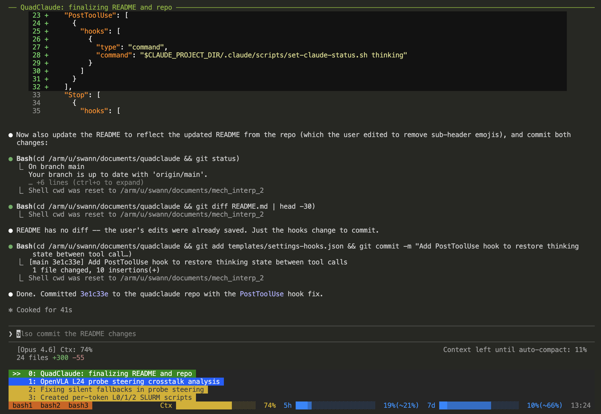

# QuadClaude

A tmux-based workspace manager for running multiple [Claude Code](https://docs.anthropic.com/en/docs/claude-code) sessions side by side with real-time status monitoring.

<!--  -->

## Features

**Multi-session workspace** -- Launch multiple Claude Code windows and bash utility windows in a single tmux session, with clickable window selection from the status bar.

**Live status colors** -- Each window's status bar entry changes color based on Claude's state:
- Blue: thinking (processing your prompt)
- Yellow: running (executing a tool)
- Green: idle (ready for input)
- Red: waiting (needs attention)

**Real-time progress bars** -- Context window usage, 5-hour, and 7-day API quota bars with projected usage indicators:
```
Ctx ████████████░░░░░░░░  60%   5h ███▓▓▓░░░░░░░░░░░░░░  17%(~43%)   7d █▓▓▓▓▓▓▓▓▓░░░░░░░░░░   6%(~52%)
     ^^^^^^^^^^^^                    ^^^                                  ^^^^^^^^^^^
     current usage                   projected                            projected
```

**Grid mode** -- Toggle between tabbed windows and a tiled pane layout with `Ctrl+b g`. Pane borders show each session's current task.

<!--  -->

**Auto-updating titles** -- Window names automatically update from in-progress task descriptions, so you can see what each Claude session is working on at a glance.

**Usage monitoring** -- Background polling of the Anthropic API for quota data. Authenticates via your existing Claude Code OAuth credentials.

## Requirements

- **tmux 3.2+** (multi-line status bar support)
- **Claude Code** CLI (`claude`)
- **jq** (JSON parsing)
- **curl** (API polling)
- **bash 4+**
- **GNU date** (for usage projection; macOS users need `coreutils` via Homebrew)

## Quick Start

### 1. Clone and install

```bash
git clone https://github.com/YOUR_USERNAME/quadclaude.git
cd quadclaude
./install.sh /path/to/your/project
```

This copies scripts into your project's `.claude/scripts/` directory and sets up the Claude Code hooks.

### 2. Launch the workspace

```bash
.claude/scripts/launch-claude-workspace.sh
```

Or with custom session name and working directory:

```bash
.claude/scripts/launch-claude-workspace.sh my-session /path/to/project
```

### 3. (Optional) API usage monitoring

The progress bars for 5-hour and 7-day usage work automatically if you're logged into Claude Code. The token is read from `~/.claude/.credentials.json`.

Alternatively, set `CLAUDE_OAUTH_TOKEN` in your environment or copy `.claude/scripts/.env.example` to `.claude/scripts/.env` and add your token there.

## Customization

All visual settings are in a single config file. After installation, edit `.claude/config.sh` in your project:

```bash
# --- Layout ---
CLAUDE_WS_NUM_CLAUDE=4              # Number of Claude windows
CLAUDE_WS_NUM_BASH=3                # Number of bash windows
CLAUDE_WS_PREFIX="main"             # Session name prefix (main_1, main_2, ...)

# --- Status Colors ---
CLAUDE_WS_COLOR_THINKING="colour27"   # Blue
CLAUDE_WS_COLOR_RUNNING="colour178"   # Yellow
CLAUDE_WS_COLOR_IDLE="colour28"       # Green
CLAUDE_WS_COLOR_WAITING="colour196"   # Red

# --- Bar Colors & Thresholds ---
CLAUDE_WS_BAR_COLOR_LOW="colour33"    # Usage < 60%
CLAUDE_WS_BAR_COLOR_MED="colour178"   # Usage 60-85%
CLAUDE_WS_BAR_COLOR_HIGH="colour196"  # Usage > 85%
CLAUDE_WS_BAR_THRESHOLD_MED=60
CLAUDE_WS_BAR_THRESHOLD_HIGH=85

# --- Bar Characters ---
CLAUDE_WS_BAR_FILL="█"
CLAUDE_WS_BAR_PROJ="▓"
CLAUDE_WS_BAR_EMPTY="░"
CLAUDE_WS_BAR_WIDTH=20

# --- Appearance ---
CLAUDE_WS_STATUS_BG="colour235"       # Status bar background
CLAUDE_WS_STATUS_FG="colour250"       # Status bar text
CLAUDE_WS_BASH_BAR_BG="colour166"     # Bash tab bar
CLAUDE_WS_PANE_BORDER="colour240"     # Grid mode borders
CLAUDE_WS_PANE_ACTIVE="colour33"      # Active pane border

# --- Timing ---
CLAUDE_WS_POLL_INTERVAL=60            # API poll interval (seconds)
CLAUDE_WS_THROTTLE_SECS=5             # Statusline update throttle
CLAUDE_WS_TITLE_MAX=60                # Max title characters
```

All values can also be overridden via environment variables before launching.

## What Gets Installed

```
your-project/
└── .claude/
    ├── config.sh                       # Theme and settings (edit this)
    ├── scripts/
    │   ├── launch-claude-workspace.sh  # Entry point
    │   ├── set-claude-status.sh        # Hook: writes status on events
    │   ├── statusline.sh              # Context/title updater
    │   ├── get-status-color.sh        # Status -> tmux color
    │   ├── fetch-usage.sh             # API quota poller
    │   ├── render-bars.sh             # Progress bar renderer
    │   ├── toggle-layout.sh           # Grid mode toggle
    │   ├── get-claude-index.sh        # Pane -> session mapper
    │   ├── get-pane-title.sh          # Title lookup for grid borders
    │   └── .env.example               # OAuth token template
    ├── skills/
    │   └── update-status/
    │       └── SKILL.md               # Manual title update skill
    └── settings.local.json            # Hooks + statusLine config
```

## How It Works

The workspace uses **file-based IPC** via `/tmp/` for all inter-process communication. No sockets, no daemons, no lock files.

### Data Flow

1. **Claude Code hooks** (`UserPromptSubmit`, `PreToolUse`, `Stop`) write the current state (thinking/running/idle) to `/tmp/claude_status_N`
2. **statusline.sh** runs every ~300ms per session, writes context % to `/tmp/claude_context_N`, and periodically extracts in-progress task titles from the transcript
3. **tmux status bar** calls `get-status-color.sh` and `render-bars.sh` via shell expansions every 3 seconds
4. **fetch-usage.sh** polls the Anthropic API in the background and writes quota data to `/tmp/claude_usage.json`

### IPC Files

| File | Purpose |
|------|---------|
| `claude_status_N` | Window state (thinking/running/idle/waiting) |
| `claude_title_N` | Window display title |
| `claude_context_N` | Context window usage % |
| `claude_usage.json` | API quota data (5h + 7d) |
| `claude_index_cache_*` | Cached pane-to-session mapping |

## Keybindings

| Key | Action |
|-----|--------|
| `Ctrl+b g` | Toggle grid mode (tiled panes vs. tabbed windows) |
| `Ctrl+b 0-3` | Switch to Claude window 0-3 |
| `Ctrl+b 4-6` | Switch to bash window 1-3 |
| Click status bar | Switch to clicked window |

## Compatibility

- Tested with tmux 3.4 on Linux
- Requires tmux 3.2+ for multi-line status bar (`status N`)
- The `date -d` in `render-bars.sh` requires GNU date. On macOS, install `coreutils` via Homebrew.
- Scripts handle both GNU and BSD `stat` for file modification times.

## License

MIT
